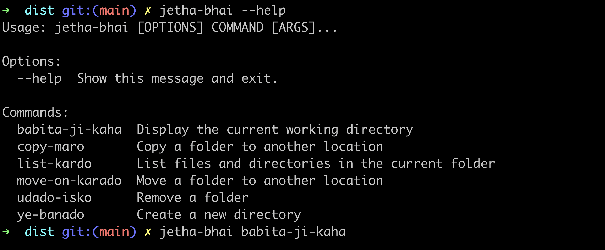

# Jetha-Bhai CLI

Jetha-Bhai CLI is a command-line interface that provides a fun and unique way to interact with your file system. It mimics some common shell commands, but with a twist. Each command is translated into the language of Jetha-Bhai, a popular character from Indian television.



## Installation

```bash
pip install jetha-cli
```

# Test Cmd

```bash
jetha-bhai --help
jetha-bhai ye-banado f1
jetha-bhai list-kardo
```

## Table

| Command (Shell)        | jetha-bhai CLI Command            | Description                                     |
| ---------------------- | --------------------------------- | ----------------------------------------------- |
| `pwd`                  | `jetha-bhai babita-ji-kaha`       | Display the current working directory.          |
| `ls`                   | `jetha-bhai list-kardo`           | List files and directories.                     |
| `mkdir <dirname>`      | `jetha-bhai ye-banado <dirname>`  | Create a new directory.                         |
| `mv <src> <dest>`      | `jetha-bhai move-on-karado <src> <dest>` | Move a file or directory.                    |
| `rm -rf <path>`        | `jetha-bhai udado-isko <path>`    | Remove a file or directory.                     |
| `cp -r <src> <dest>`   | `jetha-bhai copy-maro <src> <dest>` | Copy a file or directory.                       |
| `git init`             | `jetha-bhai git-chalu-karo`       | Initialize a new Git repository.                |
| `git commit -m "msg"`  | `jetha-bhai commit-maro "msg"`    | Record changes to the repository with a message. |

# Thank you
